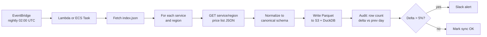
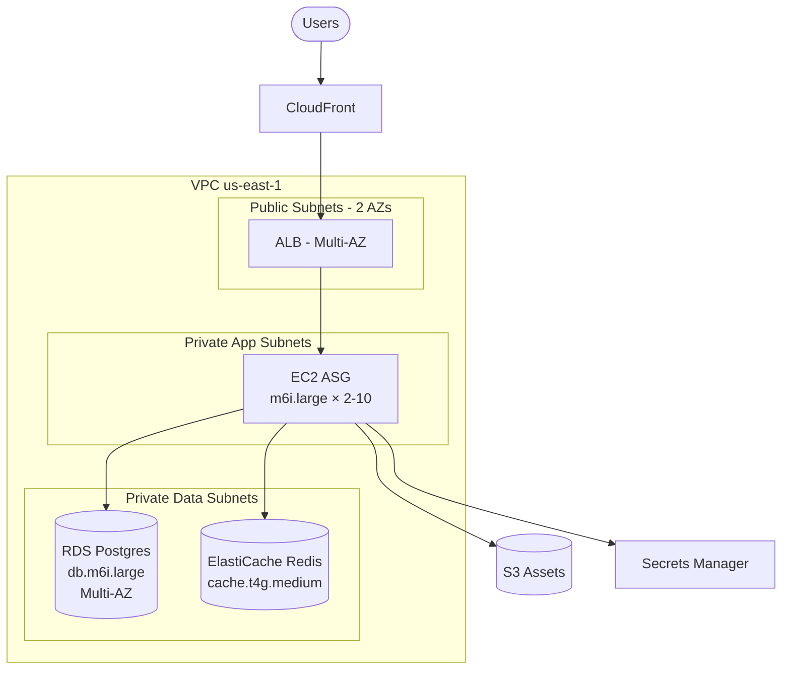

# AI-Powered Cloud Cost & Architecture Calculator
## Technical Design Document — v1 (AWS-first, multi-cloud-ready)

---

## 1. Mission & Principles

Build a conversational system that turns natural-language workload descriptions into **defensible** AWS architecture recommendations with **traceable** cost estimates derived from live pricing data.

### Design principles

1. **LLM orchestrates, never computes pricing or invents SKUs.** The model drives requirement gathering and tool selection. All numerical and identifier-bearing outputs come from validated tools.
2. **Patterns over generation.** Architectures are *selected and parameterized* from a curated library of well-architected blueprints, not synthesized from scratch.
3. **Every recommendation is a chain of decisions.** Each step (requirement → pattern → service → SKU → price) emits a structured `DecisionRecord`. The UI renders these as the explainability layer.
4. **Pricing is data, not a service call per request.** The Price List API is synced into a local store; runtime queries are local and fast.
5. **Canonical service taxonomy is a first-class abstraction.** Patterns are written in canonical roles (`relational_db`, `load_balancer`); provider adapters realize them. AWS adapter ships in v1; Azure/GCP slot in without touching patterns.
6. **Refuse on insufficient information.** If a requirement gap would change the architecture or cost by >20%, the agent asks rather than assumes.

### Non-goals (v1)
- Deployment / IaC generation (Terraform, CloudFormation) — phase 2.
- Reserved Instance / Savings Plan optimization across an existing portfolio — phase 3.
- FinOps drift monitoring of deployed workloads — out of scope.

---

## 2. Logical Architecture

```mermaid
flowchart TB
    User([User])
    subgraph Frontend["Frontend (React + TS)"]
        Chat[Chat Pane]
        Diagram[Diagram Pane]
        Cost[Cost Pane]
        Why[Why-this Pane]
    end

    subgraph Backend["Backend (FastAPI)"]
        API[REST + SSE Gateway]
        Orch[Agent Orchestrator]
        Tools[Tool Registry]
    end

    subgraph Tools_Detail["Tools"]
        PatMatch[match_pattern]
        Price[get_pricing]
        Valid[validate_sku]
        Cost_T[compute_cost]
        Diag[render_diagram]
        Rec[record_decision]
    end

    subgraph Data["Data Plane"]
        PDL[(Pricing Store<br/>DuckDB/Parquet)]
        PatRepo[(Pattern Library<br/>YAML repo)]
        DRStore[(Decision Records<br/>Postgres)]
        ConvStore[(Conversation State<br/>Postgres)]
    end

    LLM[Claude API]
    PriceAPI[AWS Price List API]

    User <--> Frontend
    Frontend <-->|SSE / REST| API
    API <--> Orch
    Orch <-->|tool_use loop| LLM
    Orch --> Tools
    Tools --> Tools_Detail
    PatMatch --> PatRepo
    Price --> PDL
    Valid --> PDL
    Cost_T --> PDL
    Rec --> DRStore
    Orch --> ConvStore
    PDL <-.nightly sync.- PriceAPI
```

### Component responsibilities (one line each)

| Component | Responsibility |
|---|---|
| **React frontend** | Chat UI, live-updating diagram, cost panel, decision-record drawer. |
| **API gateway (FastAPI)** | Auth, session, SSE streaming of LLM/tool events to UI. |
| **Agent orchestrator** | Runs the tool-use loop; manages conversation state; enforces guardrails. |
| **Tool registry** | Pydantic-typed tools exposed to the LLM via Anthropic tool-use schema. |
| **Pattern library** | Versioned YAML blueprints in canonical taxonomy + provider realizations. |
| **Pricing store** | Local query layer over normalized AWS pricing data. |
| **Sync worker** | Scheduled job that pulls Price List bulk JSON, normalizes, writes Parquet. |
| **Decision record store** | Append-only log of every reasoning step. |

---

## 3. Agent Design

### 3.1 The loop

```python
async def run_turn(conversation_id: UUID, user_msg: str) -> AsyncIterator[Event]:
    state = await load_state(conversation_id)
    state.messages.append({"role": "user", "content": user_msg})

    while True:
        response = await anthropic.messages.create(
            model="claude-opus-4-7",  # final synthesis; use sonnet for tool steps
            system=SYSTEM_PROMPT,
            tools=TOOL_SCHEMAS,
            messages=state.messages,
            max_tokens=4096,
        )

        # stream text deltas to UI as they arrive
        yield AssistantTextEvent(response.text_blocks)

        if response.stop_reason != "tool_use":
            state.messages.append(response.assistant_message)
            await save_state(state)
            return  # turn complete

        # execute every tool_use block, append results, loop
        tool_results = []
        for block in response.tool_use_blocks:
            result = await TOOL_REGISTRY[block.name](**block.input)
            await record_decision(conversation_id, block, result)
            yield ToolEvent(block.name, block.input, result)
            tool_results.append({
                "type": "tool_result",
                "tool_use_id": block.id,
                "content": result.model_dump_json()
            })

        state.messages.append(response.assistant_message)
        state.messages.append({"role": "user", "content": tool_results})
```

### 3.2 Tool contracts

All tools are Pydantic models — schemas are auto-generated for the Anthropic tool-use API. Validation happens before tool body executes; LLM gets typed errors back if it hallucinates fields.

```python
class WorkloadProfile(BaseModel):
    workload_type: Literal["web_app", "api", "batch", "stream", "ml_inference",
                           "ml_training", "data_lake", "static_site", "saas_multitenant"]
    user_count: int | None = None
    rps_peak: int | None = None
    rps_avg: int | None = None
    data_volume_gb: float | None = None
    data_growth_gb_month: float | None = None
    state: Literal["stateless", "stateful"]
    consistency: Literal["strong", "eventual"] | None = None
    availability_target: Literal["single_az", "multi_az", "multi_region"]
    region: str = "us-east-1"
    compliance: list[Literal["hipaa", "pci", "fedramp", "gdpr", "none"]] = ["none"]
    budget_monthly_usd: float | None = None
    optimization_priority: Literal["cost", "performance", "balanced"] = "balanced"

class MatchPatternInput(BaseModel):
    profile: WorkloadProfile

class MatchPatternOutput(BaseModel):
    candidates: list[PatternMatch]  # ranked, with score + rationale

class PricingQuery(BaseModel):
    service: str            # 'ec2', 'rds', 's3', etc. (canonical)
    region: str
    selectors: dict[str, Any]  # service-specific filter
    term: Literal["on_demand", "reserved_1y_no_upfront", "reserved_3y_partial",
                  "savings_plan_compute_1y", "spot"] = "on_demand"

class PricingResult(BaseModel):
    sku: str
    unit_price: Decimal
    unit: str               # 'Hrs', 'GB-Mo', 'GB', 'Requests'
    currency: str = "USD"
    pricing_dimensions: dict[str, str]  # what was matched
    sync_timestamp: datetime
    source_url: str         # back to AWS price list

class ValidateSkuInput(BaseModel):
    service: str
    sku: str
    region: str

class Architecture(BaseModel):
    pattern_id: str
    components: list[Component]    # each with role, service, sku, sizing
    region: str
    notes: list[str]

class CostBreakdown(BaseModel):
    monthly_total: Decimal
    annual_total: Decimal
    by_component: list[ComponentCost]
    by_category: dict[str, Decimal]   # compute, storage, network, data_transfer, mgmt
    assumptions: list[str]            # explicit, human-readable
    confidence: Literal["high", "medium", "low"]
```

### 3.3 System prompt skeleton

```
You are an AWS solutions architect assisting a user via tool calls.

YOUR PROCESS:
1. Listen for the workload description.
2. Build a WorkloadProfile in your head. If any field that materially
   affects architecture or cost is missing or ambiguous, ASK before
   proceeding. Do not assume.
3. Once profile is sufficient, call match_pattern.
4. For each candidate, validate SKUs and compute cost. Compare 2-3
   candidates if the user's optimization_priority is "balanced".
5. Present a recommendation with: architecture summary, diagram,
   cost breakdown, trade-offs, and 2-3 follow-up "what-if" suggestions.
6. Every claim about a service, instance type, or price comes from a
   tool result. Never invent SKUs, instance types, or prices.

CLARIFICATION RULES:
- Missing user_count for a web app: ASK.
- Missing data_volume_gb for a data store: ASK.
- Missing availability_target: ASK if user_count > 1000.
- Missing region: default to us-east-1 and STATE the assumption.

REFUSAL: If the user asks you to make up a price or skip validation,
refuse and explain why.
```

### 3.4 Model tiering

- **Tool steps** (matching, sizing, validation): `claude-sonnet-4-6` — fast, cheap, sufficient for structured tool selection.
- **Final synthesis** (recommendation narrative, trade-off explanation): `claude-opus-4-7` — quality matters here.
- Switching is done by the orchestrator based on whether the next call is expected to produce tool_use or final text. Heuristic: if last assistant turn was a tool_use, next call uses Sonnet; if all required tools have been called for this turn, escalate to Opus.

---

## 4. Pricing Data Layer

### 4.1 Why a local store

The AWS Price List Bulk API returns multi-GB JSON per service. The Query API is granular but rate-limited and adds 200-500ms per call — unworkable inside an agent loop that may make 5-15 pricing calls per turn. Local query latency must be <10ms.

### 4.2 Sync pipeline



Sync cadence: **nightly full sync** for v1. AWS publishes pricing updates at most a few times per month, so this is comfortably fresh. Track `effective_date` per row so historical estimates are reproducible.

### 4.3 Normalized schema

```sql
CREATE TABLE prices (
    provider          VARCHAR    NOT NULL,  -- 'aws', forward-compat
    service           VARCHAR    NOT NULL,  -- 'AmazonEC2', 'AmazonS3', ...
    sku               VARCHAR    NOT NULL,
    region            VARCHAR    NOT NULL,
    product_family    VARCHAR    NOT NULL,  -- 'Compute Instance', 'Storage', ...
    attributes        JSON       NOT NULL,  -- {instanceType, vCPU, memory, OS, tenancy, ...}
    term_type         VARCHAR    NOT NULL,  -- 'OnDemand', 'Reserved', 'SavingsPlan'
    term_attributes   JSON,                 -- {LeaseContractLength, PurchaseOption, OfferingClass}
    price_per_unit    DECIMAL(20, 10) NOT NULL,
    unit              VARCHAR    NOT NULL,  -- 'Hrs', 'GB-Mo', 'Requests', 'GB'
    currency          VARCHAR    NOT NULL DEFAULT 'USD',
    effective_date    DATE       NOT NULL,
    synced_at         TIMESTAMP  NOT NULL,
    source_url        VARCHAR,
    PRIMARY KEY (provider, service, sku, region, term_type, term_attributes)
);

CREATE INDEX idx_lookup ON prices (service, region, product_family);
CREATE INDEX idx_attrs ON prices USING GIN (attributes);  -- for JSON filters
```

Stored as **Parquet on S3, partitioned by `provider/service/region`**, queried via DuckDB with the `httpfs` extension. This pattern gives:
- Sub-10ms median query for a single SKU lookup.
- Trivial multi-cloud extension (add partition value).
- Versioning for free (append `effective_date`, never destructive overwrite).
- Cheap: a year of price history is <5GB.

### 4.4 Query patterns the LLM hits

| Tool | Translates to |
|---|---|
| `get_pricing(service='ec2', region='us-east-1', selectors={'instance_type': 'm6i.large', 'os': 'Linux', 'tenancy': 'Shared'}, term='on_demand')` | `SELECT sku, price_per_unit, unit FROM prices WHERE service='AmazonEC2' AND region='us-east-1' AND attributes->>'instanceType'='m6i.large' AND attributes->>'operatingSystem'='Linux' AND term_type='OnDemand' AND effective_date = (SELECT MAX(effective_date) FROM prices)` |
| `validate_sku(service='ec2', sku='ABC123...')` | Existence check on `(service, sku, region)`. |
| `compute_cost(architecture)` | Aggregates per-component: hours × unit_price + storage_gb × gb_mo + data_transfer × per_gb. |

---

## 5. Pattern Library

### 5.1 Canonical service taxonomy

The abstraction that lets v2 add Azure/GCP without rewriting patterns. Roles, not products.

| Canonical role | AWS realization | Azure realization (future) | GCP realization (future) |
|---|---|---|---|
| `edge_cdn` | CloudFront | Front Door | Cloud CDN |
| `load_balancer` | ALB | Application Gateway | Cloud Load Balancing |
| `compute_horizontal` | EC2 + ASG | VMSS | MIG |
| `compute_serverless` | Lambda | Functions | Cloud Functions |
| `compute_container_orchestrated` | EKS / ECS Fargate | AKS | GKE |
| `relational_db` | RDS | Azure SQL / Postgres Flex | Cloud SQL |
| `nosql_keyvalue` | DynamoDB | Cosmos (Table) | Bigtable / Firestore |
| `cache` | ElastiCache | Cache for Redis | Memorystore |
| `object_storage` | S3 | Blob Storage | Cloud Storage |
| `block_storage` | EBS | Managed Disks | Persistent Disk |
| `message_queue` | SQS | Service Bus | Pub/Sub |
| `event_stream` | Kinesis / MSK | Event Hubs | Pub/Sub Lite |
| `secrets_store` | Secrets Manager | Key Vault | Secret Manager |
| `identity` | Cognito / IAM | Entra ID | Identity Platform |
| `data_warehouse` | Redshift | Synapse | BigQuery |
| `search` | OpenSearch | AI Search | Vertex AI Search |

### 5.2 Pattern schema

One YAML per pattern, in `patterns/` repo, semver'd.

```yaml
id: web-app-3tier
version: 1.0.0
name: 3-tier highly-available web application
summary: Stateful web app with relational DB, cache, CDN, and autoscaling compute.

applicable_when:
  workload_type: [web_app, saas_multitenant]
  state: stateful
  user_count: { min: 1000 }
  consistency: strong

components:
  - role: edge_cdn
  - role: load_balancer
    properties: { layer: 7, tls_termination: true }
  - role: compute_horizontal
    properties: { autoscale: true, min: 2, max: 50 }
  - role: relational_db
    properties: { multi_az: true, engine: postgres }
  - role: cache
    properties: { engine: redis }
  - role: object_storage
    properties: { use: static_assets_and_uploads }
  - role: secrets_store

sizing_rules:
  - when: { user_count_lt: 50000 }
    set:
      compute_horizontal: { instance_class: m6i.large, min: 2, max: 10 }
      relational_db: { instance_class: db.m6i.large, storage_gb: 100 }
      cache: { node_type: cache.t4g.medium, num_nodes: 2 }
  - when: { user_count_gte: 50000, user_count_lt: 1000000 }
    set:
      compute_horizontal: { instance_class: m6i.xlarge, min: 4, max: 30 }
      relational_db: { instance_class: db.m6i.xlarge, storage_gb: 500, read_replicas: 1 }
      cache: { node_type: cache.r7g.large, num_nodes: 3 }
  - when: { user_count_gte: 1000000 }
    set:
      compute_horizontal: { instance_class: m6i.2xlarge, min: 6, max: 100 }
      relational_db: { instance_class: db.r6i.2xlarge, storage_gb: 2000, read_replicas: 2 }
      cache: { node_type: cache.r7g.xlarge, num_nodes: 6 }

assumptions:
  - "Read/write ratio ~80/20"
  - "Avg request size 50KB, response 200KB"
  - "Cache hit ratio target 70%"

trade_offs:
  pros: [proven_pattern, ha_multi_az, scales_horizontally, mature_tooling]
  cons: [higher_baseline_cost_than_serverless, db_vertical_scaling_only_on_writer]

alternatives:
  - pattern_id: web-app-serverless
    when_better: low_or_spiky_traffic
  - pattern_id: web-app-eks-microservices
    when_better: many_services_or_polyglot

provider_realization:
  aws:
    edge_cdn: { service: cloudfront }
    load_balancer: { service: elasticloadbalancing, type: application }
    compute_horizontal: { service: ec2_with_asg, ami_family: amazon_linux_2023 }
    relational_db: { service: rds, engine_version: "15" }
    cache: { service: elasticache, engine: redis }
    object_storage: { service: s3, storage_class: standard }
    secrets_store: { service: secrets_manager }
  # azure: { ... }   # added in v2
  # gcp:   { ... }   # added in v2

diagram_template: web-app-3tier.mermaid.j2
```

### 5.3 Pattern matching

`match_pattern` is **not** an LLM call. It's a deterministic ranker:

```python
def match_pattern(profile: WorkloadProfile) -> list[PatternMatch]:
    candidates = []
    for pattern in PATTERN_REPO.all():
        if not pattern.applicable_when.matches(profile):
            continue
        score = score_pattern(pattern, profile)   # weighted on optimization_priority
        candidates.append(PatternMatch(pattern=pattern, score=score, reasons=...))
    return sorted(candidates, key=lambda c: -c.score)[:3]
```

Scoring weights:
- `cost`: bias toward serverless/spot patterns when `optimization_priority='cost'`.
- `performance`: bias toward provisioned, multi-AZ, larger instances.
- `balanced`: split.

The LLM then picks among the top 3 with explanation, optionally compares two side-by-side.

### 5.4 Pattern coverage for v1

Ship with these patterns to cover ~80% of typical workload requests:
1. Static site (S3 + CloudFront)
2. 3-tier web app (this doc's example)
3. Serverless API (API GW + Lambda + DynamoDB)
4. Container microservices (ALB + ECS Fargate + RDS)
5. EKS microservices (for users explicitly asking k8s)
6. Batch processing (Batch + S3 + EventBridge)
7. Data lake (S3 + Glue + Athena)
8. ML inference endpoint (SageMaker endpoint OR Lambda+EFS)
9. Analytics warehouse (Redshift Serverless + S3 staging)
10. Event-driven pipeline (Kinesis/EventBridge + Lambda + DynamoDB)

---

## 6. Diagram Generation

Mermaid templates per pattern, rendered server-side from the resolved `Architecture` object. Component IDs and labels populated from selected services + sizing.

```python
def render_diagram(arch: Architecture) -> str:
    tmpl = jinja_env.get_template(arch.pattern.diagram_template)
    return tmpl.render(
        components=arch.components,
        region=arch.region,
        annotations=[c.sizing_label() for c in arch.components],
    )
```

Frontend renders Mermaid client-side via `mermaid.js`. Export: SVG download is one Mermaid API call.

Example Mermaid output for the 3-tier pattern:



---

## 7. Explainability — Decision Records

Every meaningful step the agent takes appends a `DecisionRecord`. The frontend "Why this?" panel reads them and renders a chronological reasoning trace. This is the feature that makes outputs *defensible* rather than oracular.

```python
class DecisionRecord(BaseModel):
    id: UUID
    conversation_id: UUID
    turn_number: int
    timestamp: datetime
    type: Literal[
        "requirement_clarified",
        "pattern_matched",
        "pattern_selected",
        "component_sized",
        "sku_validated",
        "price_fetched",
        "trade_off_evaluated",
        "alternative_compared",
    ]
    inputs: dict
    output: dict
    reasoning: str          # short, LLM-generated
    sources: list[Source]   # pattern_id@version, AWS price list URL, SKU
    confidence: Literal["high", "medium", "low"]
```

Sample chain for a user request "I need a web app for ~500K users in us-east-1":

| # | Type | Summary |
|---|---|---|
| 1 | requirement_clarified | Asked for state/consistency/availability target. User answered: stateful, strong, multi-AZ. |
| 2 | pattern_matched | 3 candidates: web-app-3tier (0.92), web-app-eks-microservices (0.71), web-app-serverless (0.55). |
| 3 | pattern_selected | Chose web-app-3tier@1.0.0 — best score; user not requesting microservices; serverless cold-start risk at 500K MAU. |
| 4 | component_sized | Applied sizing rule `user_count_gte:50000`. Compute m6i.xlarge×4-30, RDS db.m6i.xlarge + 1 read replica. |
| 5 | sku_validated | All 7 SKUs confirmed in pricing store, effective_date 2026-04-27. |
| 6 | price_fetched | Itemized 7 line items totaling $X/mo on-demand. |
| 7 | trade_off_evaluated | Reserved 1y partial would save 38% if commit feasible. Spot not applicable to RDS/cache. |

---

## 8. Tech Stack & Repo Layout

| Layer | Choice | Why |
|---|---|---|
| Frontend | React 18 + TypeScript + Vite + Tailwind | Standard; chat + diagram + cost panes |
| Diagrams | mermaid.js (client-side) | Per directive; SVG export trivial |
| State | Zustand or Redux Toolkit | Conversation, decision records, current arch |
| Streaming | SSE (server-sent events) | Simpler than WS for unidirectional stream |
| Backend | FastAPI + Pydantic v2 | Tool schema generation falls out of Pydantic |
| LLM | Anthropic SDK (Python) | Per directive |
| Pricing query | DuckDB + Parquet on S3 | <10ms queries, multi-cloud-ready storage |
| Pattern store | YAML files in repo + watcher | Versioned, code-reviewed, rollback-able |
| Persistence | Postgres (conversations, decision records) | Boring is good |
| Sync worker | EventBridge → Lambda (or ECS task) | Nightly, idempotent |
| Auth | Cognito or Auth0 | Out of the critical path for v1 |
| Deployment | ECS Fargate behind ALB; S3+CF for FE | Standard 3-tier eats its own dogfood |

```
repo/
├── backend/
│   ├── app/
│   │   ├── api/                 # FastAPI routes + SSE
│   │   ├── orchestrator/        # agent loop
│   │   ├── tools/               # tool implementations + pydantic schemas
│   │   ├── pricing/             # DuckDB query layer
│   │   ├── patterns/            # YAML loader, matcher, scorer
│   │   ├── diagrams/            # Jinja2 mermaid templates
│   │   ├── decisions/           # DecisionRecord store
│   │   ├── providers/
│   │   │   ├── base.py          # canonical taxonomy interfaces
│   │   │   ├── aws/             # AWS realizer
│   │   │   ├── azure/           # stub for v2
│   │   │   └── gcp/             # stub for v2
│   │   └── prompts/             # system prompts, examples
│   ├── workers/
│   │   └── pricing_sync/        # nightly sync job
│   └── tests/
├── patterns/                    # versioned YAML pattern library
│   ├── web-app-3tier.yaml
│   ├── web-app-serverless.yaml
│   └── ...
├── frontend/
│   ├── src/
│   │   ├── components/          # ChatPane, DiagramPane, CostPane, WhyPane
│   │   ├── hooks/               # useSSEStream, useConversation
│   │   └── lib/                 # mermaid wrapper, api client
└── infra/                       # IaC for self-hosting (later)
```

---

## 9. Phased Roadmap

| Phase | Scope | Outcome |
|---|---|---|
| **0. Spike** | Pricing sync + DuckDB query for EC2/RDS/S3 only; CLI to validate. | Confidence pricing layer is sound. |
| **1. MVP** | Agent loop, 5 patterns, AWS-only, chat+diagram+cost UI, decision records. | Demoable; covers ~70% of typical asks. |
| **2. Coverage** | All 10 v1 patterns, RI/Spot/Savings Plans terms, what-if comparisons. | Production-pilot ready. |
| **3. Multi-cloud** | Azure adapter + Azure Retail Prices API sync; pattern realizations. | Demonstrates abstraction works. |
| **4. Multi-cloud** | GCP adapter + Cloud Billing Catalog API sync. | All three. |
| **5. Optimization** | RI/SP optimizer over a portfolio; multi-region cost-vs-latency advisor. | Differentiator vs vanilla calculators. |
| **6. IaC export** | Terraform / CDK output for selected architecture. | Closes the loop to deployment. |

---

## 10. Risks & Mitigations

| Risk | Impact | Mitigation |
|---|---|---|
| **LLM hallucinates SKU / instance type** | Wrong price, eroded trust | All SKU/type values flow through `validate_sku` before pricing; system prompt forbids invention; integration test suite asserts no unvalidated identifiers leak to UI. |
| **Pricing data drifts vs AWS** | Estimate error | Nightly sync; row-count delta alerts; show `synced_at` and `effective_date` in UI; explicit "as of" label. |
| **Pattern coverage gaps** | Out-of-scope workload mishandled | Matcher returns empty → agent says "this is novel; let me describe a custom architecture and flag for human review." Don't fake a match. |
| **Agent infinite tool-call loops** | Cost blowup, latency | Hard cap on tool calls per turn (default 12); orchestrator emits a "needs more info" turn if cap hit. |
| **LLM cost per conversation** | Unit economics | Sonnet for tool steps, Opus only for final synthesis; aggressive prompt caching of tool schemas + pattern catalog; per-user rate limit. |
| **Pricing dimension complexity** (data transfer, request charges, hidden costs) | Under-estimates | Each pattern lists *required* cost categories; `compute_cost` validates all categories present; UI flags "estimate excludes X" if incomplete. |
| **Region availability mismatch** | SKU exists globally but not in selected region | `validate_sku` is region-scoped; matcher down-ranks patterns whose required services are unavailable in target region. |
| **Multi-AZ / HA assumptions hidden** | False low estimate | Pattern declares HA topology in components; `compute_cost` multiplies by AZ count; assumption surfaces in breakdown. |

---

## 11. Open questions for you

1. **Auth model** — single-tenant SaaS, multi-tenant with orgs, or self-hosted only? Affects DB schema and conversation isolation.
2. **Cost output ground truth** — willing to accept ±10% vs AWS Cost Explorer for a real workload? That's roughly what's achievable when usage patterns are estimated rather than measured.
3. **Pattern authoring** — is the pattern library curated by your team only, or do you want a contribution flow (PR-based with schema validation) for the field?
4. **Reserved/Savings recommendations** — should v1 always also show RI/SP options, or only when user opts in? Adds 2-3 line items per component.
5. **Compliance overlays** (HIPAA/PCI/FedRAMP) — surface as architecture modifications (e.g., force PrivateLink, encryption at rest with CMK), or just as a flag on output? Material design impact.

---

## 12. What the prototype will demonstrate

When you green-light, the prototype artifact will be a single-page React app that simulates the full UX:

- Chat pane with the agent loop running against a stubbed tool layer (real prompt, fixture pricing data for EC2/RDS/S3 in us-east-1, real pattern matching against 2-3 hardcoded patterns).
- Live-rendering Mermaid diagram pane.
- Cost breakdown pane with itemization, monthly/annual toggle, on-demand vs RI comparison.
- "Why this?" drawer rendering decision records.
- A "what-if" affordance for scaling user count and watching cost recompute.

The point of the prototype is to validate the **UX and decision-flow**, not the backend infrastructure (which this design doc covers). Real backend implementation follows once the design is locked.

---

## 13. Local Build Baseline (Implemented)

This repository is scaffolded for local-first development with Docker Compose.

- Frontend (Stratoscope UI): `http://localhost:80` — React 18 + Vite + TypeScript + Tailwind + lucide-react (matches `mock-sites` UX).
- Backend API: `http://localhost:8003`
- Backend health: `http://localhost:8003/health`
- Postgres: `localhost:5432`
- Redis: `localhost:6379`

Run locally:

```bash
cp .env.example .env
docker compose up --build
```

Frontend-only development (hot reload, port 5173):

```bash
cd frontend
npm install
npm run dev
```

Stop:

```bash
docker compose down
```

### Concise implementation comment

- Version Number: `0.2.0`
- What it does: Boots nginx-served Stratoscope UI (built with Vite), FastAPI backend, Postgres, and Redis aligned to locked ports for development.
- Dependencies: Docker, Docker Compose; frontend build uses Node 20; runtime nginx image includes `ksh`, `wget`, `curl`, `vim` after `apt-get update` / `upgrade`; backend Python 3.12.
- Port Number: `80`, `8003`, `5432`, `6379`; local Vite dev server `5173` (optional)
